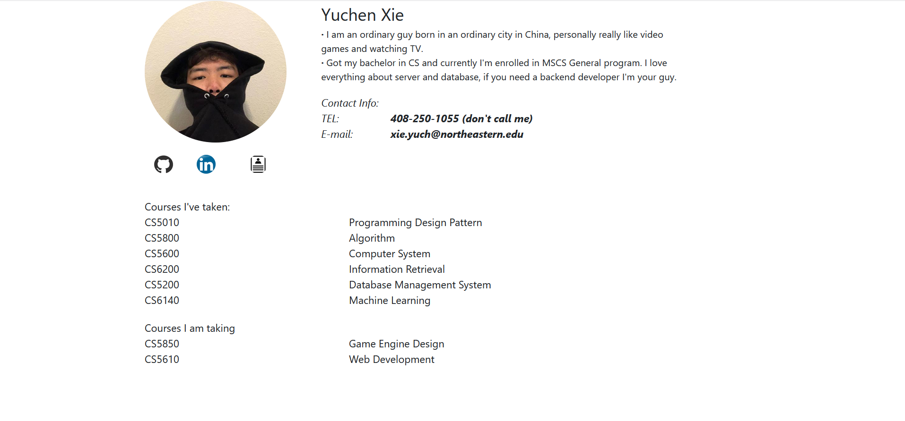
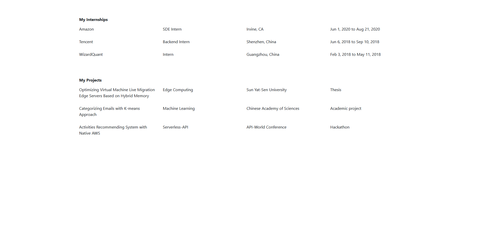

# Project 1: Personal Site of Yuchen Xie

### Authur: [Yuchen Xie](https://github.com/Yuchen112211)

### Time: 02/12/2021

### Course: [CS5610-Web Development](https://johnguerra.co/classes/webDevelopment_spring_2021/)

## Description

The Project is mainly just a simple website using nothing fancy, a little bootstrap with a little CSS and plain JavaScript. The website don't even have a background image, but this is the best I got for the moment, along with the studying in the future my frontend skills will improve.

What a pleasant surprise opening your page!

## Project objective

- Demonstarte personal information.
- Show the courses that I have taken and am taking.
- Integrate bootstrap into the development.
- Use Vanilla JS for some of the features.
- Create a readable web page using the techniques mentioned before.

## How to use

1. Visit the site by clicking the [link](https://yuchen112211.github.io/)
2. SKim through the web page.
3. Try hover your mouse to the portrait of mine, there's a surprise.
4. Click the `Resume` image, the one to the right of the LinekdIn image.
5. Read the other web page I wrote for my resume.

## Technical Details

- The general web content used Bootstrap Grid system to arrange the elements.
- There should be a favicon for the page.
- `Courses` and `Resume` sections used JavaScript to generate all the elements.
- `Resume` section used JavaScript to load data from a JSON file.
- General font style or font size and animation are implemented by separate CSS file.

  P.S: If you allow the autoplay on your browser (The option just to the left of the web link), you would find something really fun after you reload my personal page.

## Screenshot

## Video Demonstration

https://youtu.be/bq9I1vjtaxA
